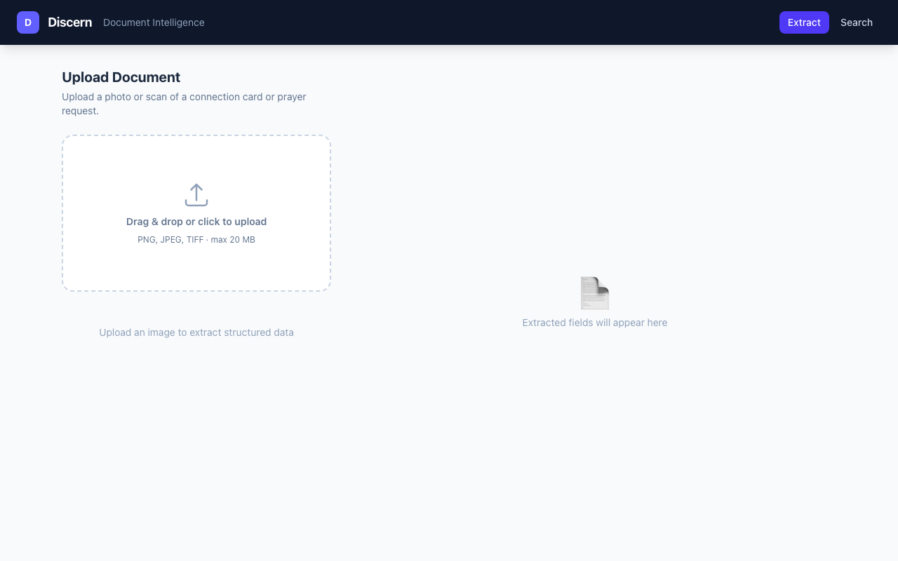
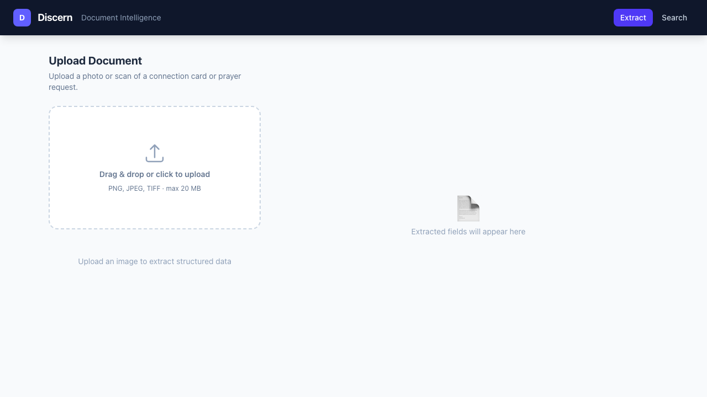

# Discern

> Computer vision that turns paper records into structured, searchable data.

Discern is a document-intelligence pipeline that processes photos and scans of paper church records — connection cards, prayer request cards, and weekly bulletins — and extracts structured, searchable data. The document domain is fully swappable via a single YAML config.

---

## Screenshots

| Upload & Extract | Search Records |
|:-:|:-:|
|  |  |

---

## What it does

1. **Upload** a photo of a paper form (JPEG / PNG / TIFF, max 20 MB).
2. **Extract** — a ResNet-18 backbone with multi-task heads classifies the document type and decodes checkbox fields; the full overlay image annotates each field with its confidence score.
3. **Store** — results land in Postgres (SQLAlchemy + Alembic) for search.
4. **Search** — query field values or filter by document type via `GET /search`.
5. **Edit** — the Next.js UI lets you correct extracted values before saving.

---

## Architecture

```
discern/
  src/discern/
    data/        synthetic generator · preprocessing (deskew, denoise, CLAHE)
    models/      ResNet-18 backbone · multi-task heads (doc-type, checkbox fields)
    training/    Trainer · OneCycleLR · checkpoint save/load · structlog logging
    inference/   InferenceEngine · EXIF strip · overlay renderer
    eval/        field-level P/R/F1 · CER/WER · p50/p95 latency by capture type
    api/         FastAPI: POST /extract · GET /search · GET /health
    db/          SQLAlchemy ORM · Alembic migrations (documents + extraction_fields)
  scripts/       generate_data.py · train.py · evaluate.py
  frontend/      Next.js 16: drag-drop upload · overlay · editable fields · search
  configs/       documents.yaml (schema contract) · train.yaml
  docker/        Dockerfile.api · Dockerfile.frontend · docker-compose.yml
  reports/       eval.json · eval.md (generated by scripts/evaluate)
```

`configs/documents.yaml` is the **single source of truth**. Swap it to retarget the whole pipeline to a different document domain.

---

## Quick Start

```bash
python -m venv .venv && source .venv/bin/activate
pip install -e ".[dev]"
pre-commit install
make verify          # lint + typecheck + tests + eval
```

---

## Verification Gate

```bash
ruff check . && ruff format --check .   # lint / format
mypy src                                 # type check
pytest -q                               # 109 tests
python -m scripts.evaluate             # metrics report
```

---

## Running Locally

### Python API

```bash
# 1. Start Postgres (Docker)
docker compose -f docker/docker-compose.yml up db -d

# 2. Apply migrations
make migrate

# 3. Serve
make serve
# → http://localhost:8000/docs
```

### Next.js Frontend

```bash
cd frontend
NEXT_PUBLIC_API_URL=http://localhost:8000 npm run dev
# → http://localhost:3000
```

### Everything via Docker

```bash
make up          # builds api + db, starts both
# API → http://localhost:8000
```

---

## Training

```bash
make train       # uses configs/train.yaml (10 epochs, 1000 synthetic samples)
make eval        # writes reports/eval.json + reports/eval.md
```

---

## Eval Results

Evaluated on 300 held-out synthetic samples (150 per doc type, seed=999).
Handwritten field values are **not extracted** by the current model (OCR head not implemented); CER/WER = 1.0 reflects this gap. Checkbox classification achieves F1 = 0.53 after 1 training epoch without pretrained weights.

| Capture type | Precision | Recall | F1 | CER | WER | p50 latency | p95 latency |
|---|---|---|---|---|---|---|---|
| handwritten | 1.000 | 0.009 | 0.018 | 1.000 | 1.000 | 574 ms | 741 ms |
| checkbox | 0.800 | 0.400 | 0.533 | — | — | 574 ms | 741 ms |
| **overall** | **0.807** | **0.139** | **0.238** | 1.000 | 1.000 | 574 ms | 741 ms |

> Latency is CPU inference on an M-series Mac. GPU inference would be ~10× faster.

---

## Security

- Upload endpoint validates MIME type (JPEG/PNG/TIFF only) and enforces a 20 MB size limit.
- EXIF data is stripped on ingest — no GPS or device metadata is stored.
- Fields marked `sensitive: true` in `configs/documents.yaml` are masked (`[REDACTED]`) in all API responses and logs.
- No PII is ever committed to the repo; all training/eval data is synthetic.
- `torch.load` is used only for trusted internal checkpoints (`weights_only=False` is documented inline).

---

## Deployment

### Prerequisites

- A Vercel account (frontend)
- A Render account (API + Postgres)
- DNS access to `dowellstandley.com` — you will add one CNAME record

### Frontend → Vercel

1. Push the repo to GitHub.
2. In Vercel: **Add New Project** → import this repo.
3. Set **Root Directory** to `frontend`.
4. Add env var: `NEXT_PUBLIC_API_URL=https://<your-render-service>.onrender.com`
5. Deploy. Vercel gives you a `*.vercel.app` URL.
6. In Vercel **Domains**, add `discern.dowellstandley.com`.
7. In your DNS provider for `dowellstandley.com`, add:
   ```
   CNAME  discern  cname.vercel-dns.com.
   ```

### API → Render

1. In Render: **New Web Service** → connect this repo.
2. Set **Root Directory** to `.` (repo root).
3. **Build command:** `pip install -e .`
4. **Start command:** `uvicorn discern.api.app:app --host 0.0.0.0 --port $PORT`
5. Add a **Postgres** database on Render; copy the internal `DATABASE_URL`.
6. Set env vars on the web service:
   ```
   DISCERN_DATABASE_URL=<internal postgres url>
   DISCERN_LOG_LEVEL=INFO
   ```
7. Migrate: set `DISCERN_DATABASE_URL` and run `alembic upgrade head` via the Render shell.
8. Deploy. Paste the Render URL into the Vercel env var from step 4.

---

## Schema Contract

`configs/documents.yaml` drives the entire pipeline:

```yaml
document_types:
  connection_card:
    fields:
      - name: full_name
        value_type: string
        capture: handwritten     # "handwritten" | "checkbox"
        required: true
      - name: visit_type
        value_type: enum
        options: [first_time, returning, regular]
        capture: checkbox
      - name: interests
        value_type: multiselect
        options: [baptism, community_group, volunteering, prayer, membership]
        capture: checkbox
      # … more fields
  prayer_request:
    fields:
      - name: request_text
        value_type: freetext
        capture: handwritten
        sensitive: true          # masked in logs + API responses
```

Swap this file to retarget to any other paper form domain.

---

## Milestones

| # | Milestone | Status |
|---|-----------|--------|
| 1 | Scaffold + tooling + schema | ✅ |
| 2 | Synthetic data generator + preprocessing | ✅ |
| 3 | Model + training loop + checkpoints | ✅ |
| 4 | Inference + FastAPI + Postgres | ✅ |
| 5 | Eval harness + metrics report | ✅ |
| 6 | Next.js UI | ✅ |
| 7 | Docker + full deployment docs | ✅ |
